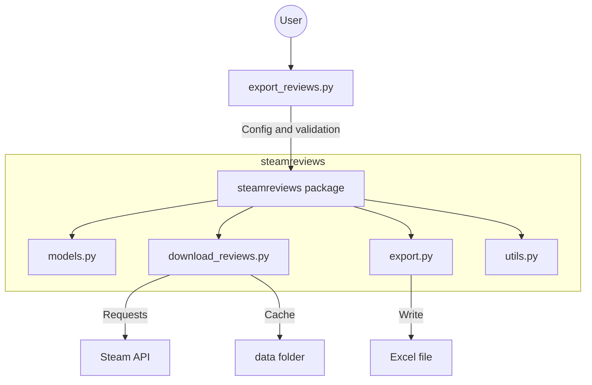

# Developer Guide

This guide explains how the project is structured and how to run the local quality checks.

## Project Architecture

The project is split into two main parts:

- `export_reviews.py`: command-line interface and user interaction.
- `steamreviews/`: reusable library code for downloading, processing, and exporting reviews.



## Key Files

| File | Purpose |
| :--- | :--- |
| `export_reviews.py` | CLI entry point. Supports interactive prompts and command-line arguments. |
| `steamreviews/models.py` | Pydantic validation for export configuration. |
| `steamreviews/download_reviews.py` | Steam API requests, pagination, rate-limit handling, and JSON cache. |
| `steamreviews/export.py` | Review filtering, URL generation, Excel safety, and Excel export. |
| `steamreviews/utils.py` | Logging setup. |
| `steamreviews/tests/` | Unit, export, CLI, and integration tests. |

## Setup

Install the project with development dependencies:

```bash
python -m pip install -e .[dev]
```

## Fast Local Checks

Run these before committing:

```bash
python -m ruff check .
python -m ruff format --check .
python -m mypy .
python -m pytest -m "not integration" --cov=steamreviews --cov-fail-under=60
```

The fast test suite does not call the live Steam API.

## Integration Tests

Integration tests are marked with `integration` because they call the live Steam API.
Run them explicitly when needed:

```bash
python -m pytest -m integration
```

These tests use temporary working directories and should not delete local project data.

## CLI Examples

Interactive mode:

```bash
steam-review-exporter
```

Scriptable mode:

```bash
steam-review-exporter --app-id 588650 --language english --filter recent --min-len 100 --output-dir exports
```
