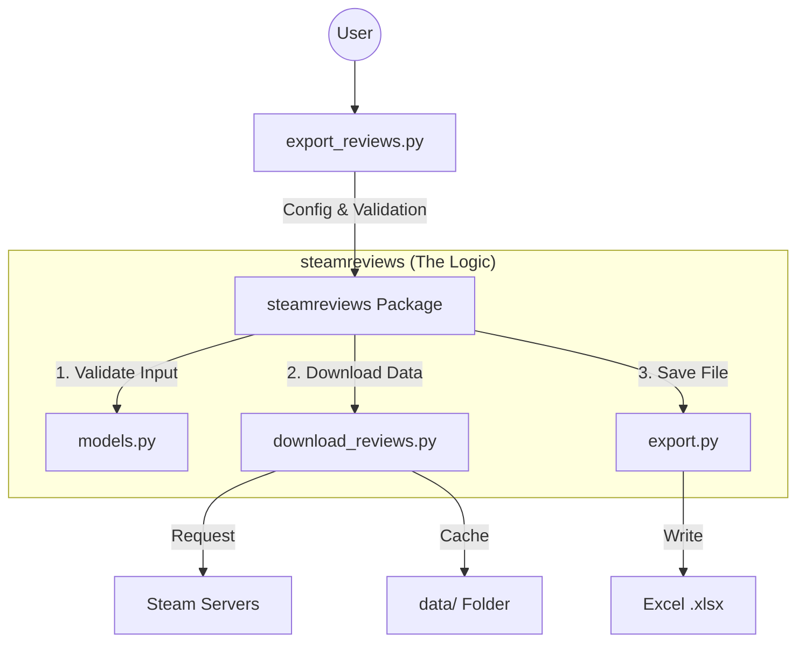

# Developer Guide 🧑‍💻

Welcome! This guide is designed for **beginners** who want to understand how this project works and how to modify it.

## 🏗️ Project Architecture (How it fits together)

The project is split into two main parts: the **Library** (logic) and the **Script** (user interface).



### Key Files Checklist

| File | Purpose | Difficulty |
| :--- | :--- | :--- |
| `export_reviews.py` | **Start Here**. The CLI (Command Line Interface). It asks the user for input. | ⭐ Easy |
| `steamreviews/models.py` | **Rules**. Defines what inputs are valid (e.g. "AppID must be a number"). | ⭐ Easy |
| `steamreviews/export.py` | **Processing**. Converts raw data into an Excel file. | ⭐⭐ Medium |
| `steamreviews/download_reviews.py` | **The Engine**. Handles downloading from Steam, Rate-Limits, and Pagination. | ⭐⭐⭐ Hard |
| `steamreviews/utils.py` | **Helper**. Sets up the colorful logging. | ⭐ Easy |

---

## 🚀 Setting Up Your Dev Environment

To change the code, you need a "Development Environment".

### 1. Install Dependencies
Instead of just running the tool, you need to install it with "developer extras" (like testing tools).

```bash
# In your terminal, run:
python -m pip install .[dev]
```

*Note: The `[dev]` part tells pip to install `pytest`, `mypy`, and `ruff` from `pyproject.toml`.*

### 2. Run the Tests
Before you change anything, make sure everything works!

```bash
python -m pytest
```
If you see **green**, you are good to go! ✅

---

## 🛠️ How to Contribute

### Step 1: Make a clear change
Don't try to change everything at once. Pick one file.
*   *Example*: Add a new user prompt in `export_reviews.py`.

### Step 2: Check your code
We use two tools to keep the code clean ("State of the Art"):

1.  **Ruff** (Checks style / formatting):
    ```bash
    python -m ruff check .
    ```
2.  **Mypy** (Checks types logic):
    ```bash
    python -m mypy .
    ```

### Step 3: Verify
Run the tests again to ensure you didn't break anything.
```bash
python -m pytest
```

---

## 🧠 Deep Dive: How Downloading Works

The complicated part is in `download_reviews.py`. Here is simple explanation of the logic:

1.  **Cursor System**: Steam doesn't give all 100,000 reviews at once. It gives 100 and a "Cursor" (a bookmark).
2.  **The Loop**:
    *   Ask Steam for reviews + cursor.
    *   Save reviews.
    *   Use new cursor to ask for the *next* 100.
    *   Repeat until Steam says "No more".
3.  **Rate Limits**: If we ask too fast, Steam blocks us. The code handles this by waiting (sleeping) automatically.

Happy Coding! 🚀
